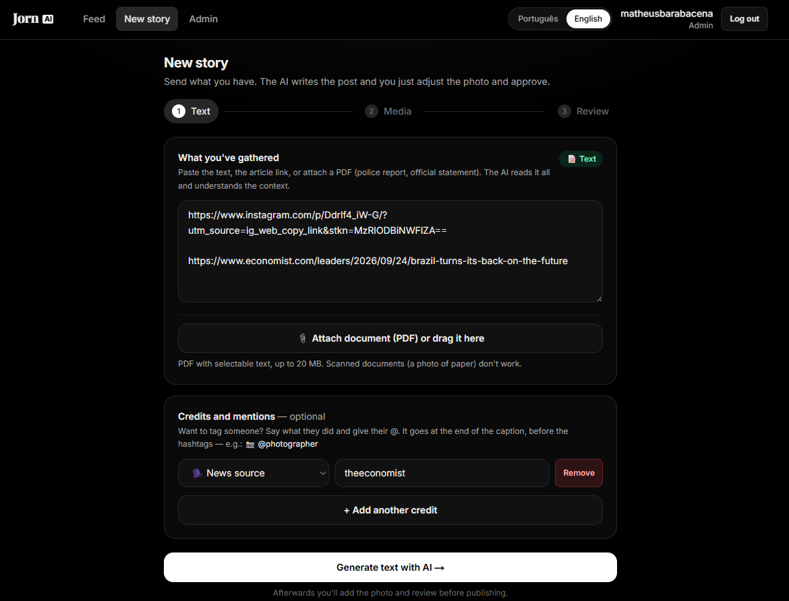
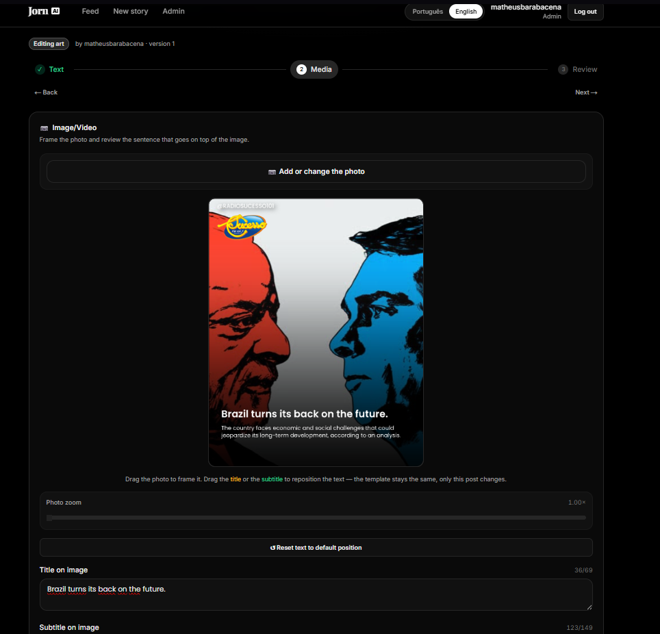
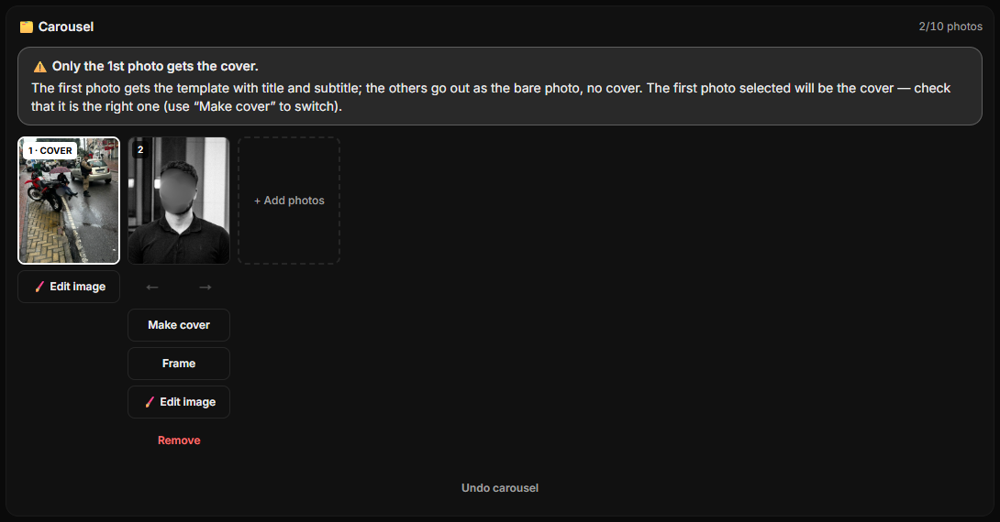
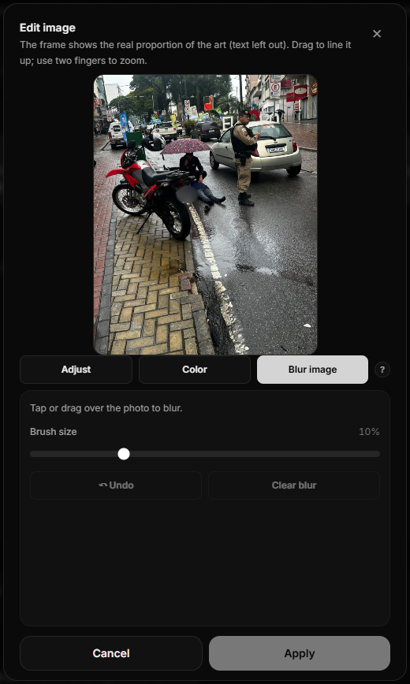
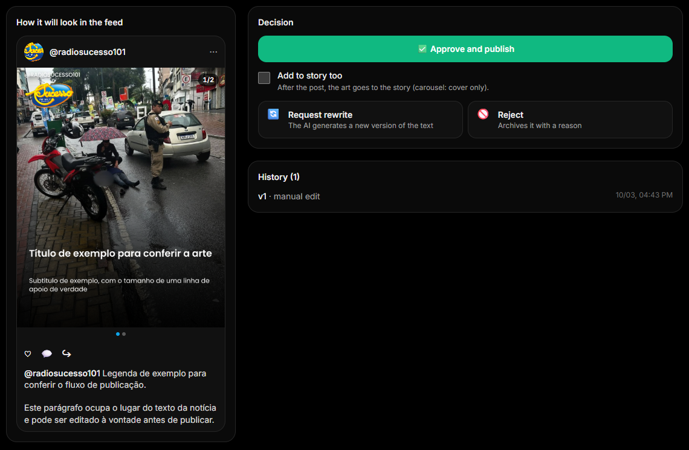
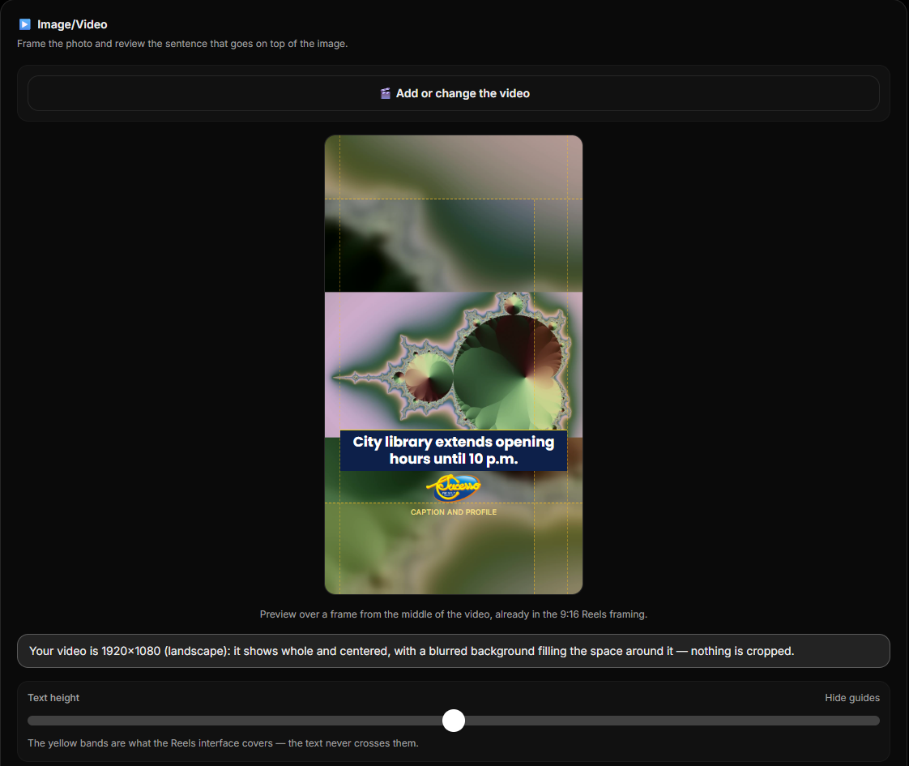
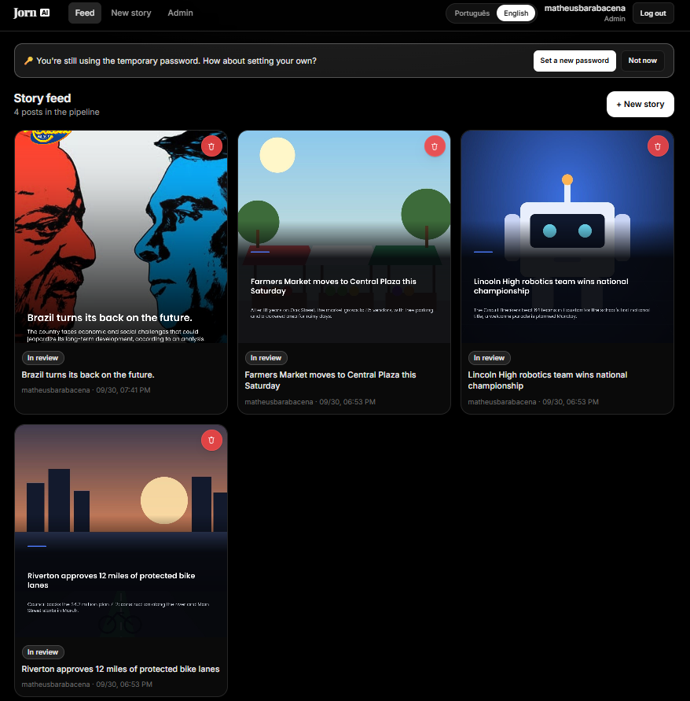

# JornAI

JornAI is a web tool that lets a newsroom publish breaking-news posts to Instagram fast, with AI writing the copy and a human always reviewing before anything goes live.

## How it works

```
Source (photo, text, link, or PDF)
        │
        ▼
AI writes the copy (title, subtitle, caption)
        │
        ▼
Reporter frames the photo(s) or video in the brand template
(single photo, carousel of up to 10, or a 9:16 Reels video)
        │
        ▼
Review → approve / reject / request a rewrite
(optionally: "Add to story too")
        │
        ▼
Publish to Instagram (feed / carousel / Reels, + story if ticked)
```

- **AI only writes text** — it never generates or picks images. Photos are always real and chosen by a person.
- Every AI generation (or manual edit) creates a **new version**, so nothing is overwritten and there's a full history.
- Nothing reaches Instagram without a human approving it first.

### 1. Send what you have

Paste a text, one or more links, or a PDF with selectable text, add credits, and the AI writes the art title (≤ 69 chars), subtitle (≤ 149) and the Instagram caption.



### 2. Frame the photo — or build a carousel

Drag and zoom the photo inside the company's template; drag the title and subtitle to reposition them for this post only.



Add more photos and it becomes a **carousel** (up to 10): the 1st photo is the cover with the template and text, the others go out as the bare photo, cropped to the same proportion (Instagram requires it). Reorder, swap the cover and frame each slide.



### 3. Edit the image without leaving the app

Every photo (cover or slide) has an **Edit image** popup:

- **Blur image** — tap or drag over the photo to hide faces, plates or anything else, with undo.
- **Adjust** — zoom, straighten, rotate, mirror, and *blurred borders* (show the whole photo and fill the rest of the frame with a mirrored, blurred copy, like the videos do).
- **Color** — brightness, contrast and saturation.

The frame in the popup is the real proportion of the art, so what you see is what gets published.

<p align="center"></p>

### 4. Review, decide — and add it to the story

The review screen shows the post exactly as it will look on Instagram (carousels can be swiped). Then:

- **Approve and publish** — it goes to Instagram. Managers/admins publish in one click; a reporter can't approve their own story, and peer approvals publish once 2 other reporters approve.
- **Add to story too** — a checkbox under the approve button, **always unticked by default**. When ticked, after the feed post goes out the art (carousel: cover only) or the rendered video is also published as an Instagram story. If the story fails, the feed post stays up and the review screen shows why.
- **Request rewrite** (optionally guiding the AI) or **Reject** with a reason.



### 5. Video and Reels

Upload an MP4, MOV or WebM (up to 100 MB) and JornAI renders a 1080×1920 Reels with an animated title card and the company logo — landscape videos are shown whole over a blurred background, and the editor shows the Reels UI safe zones.



### 6. Follow everything in the feed

Every story and its status in one place; approve or reject right from the card. Old posts clean themselves up (published after 2 days, in review or failed after 3) and leave a minimal audit record.



## Why

Newsrooms often need to get a short, urgent post out (an accident, a weather alert, a local event) with almost no friction, but still with editorial review and consistent branding — not a generic social-media scheduler, and not a raw AI text generator with no guardrails.

## Fact-accuracy pipeline

Feeding a police report or an official PDF straight into an LLM is a good way to get a confident-sounding article with wrong facts. JornAI's pipeline is built around not letting that happen:

- Source text is cleaned and compacted deterministically (no AI) before it ever reaches a model — official documents/forms get their real fields extracted (who, where, cause, injuries) instead of being blindly truncated.
- Personal data (names, CPF, phone numbers, plates) is redacted before the AI ever sees it.
- The system prompt has explicit, tested rules against inventing details, generic filler, or unsupported claims.
- Generated content is checked against the source by a deterministic validator after generation (e.g. weekday must match the source date, no unsupported claims about investigations/road closures/deaths); a violation triggers one corrective regeneration before failing loudly.

## Tech stack

- **Next.js** (App Router) + **TypeScript**, **PostgreSQL** via **Prisma**
- **Fabric.js** for the in-browser art editor, **Sharp** for server-side final render
- AI: any OpenAI-compatible or Anthropic-compatible text provider (OpenRouter, Groq, Gemini, OpenAI, Claude), with automatic fallback across providers
- **FFmpeg** for the Reels render (animated title burned into the video)
- Instagram Graph API for publishing — single image, carousel, Reels and stories

## Working language

JornAI works in one language per deployment — the language of the sources and of the generated posts — chosen with the `APP_LANGUAGE` environment variable:

| Value | Effect |
|---|---|
| `pt` (default) | Posts are written in Brazilian Portuguese; source cleanup, personal-data redaction and the fact validator use Brazilian rules (CPF, plates, police-report forms, `dd/mm/yyyy` dates). |
| `en` | Posts are written in English; same pipeline with English rules (SSN, US phone numbers, `mm/dd/yyyy` dates). |

The prompts themselves are written in English; only the examples and rules the model must reproduce live in the language pack (`src/lib/language/<lang>/`). To add a language, add a pack there and register it in `src/lib/language/index.ts`. `APP_LANGUAGE` also sets the default interface language (each person can still switch it in the UI); the code, comments and logs are always English.

## Roles

| Role | Can do |
|---|---|
| **admin** | Everything — users, API keys, templates, style examples, approve/publish |
| **manager** | Approve/reject/regenerate/edit/publish; manage templates and style examples |
| **staff** (reporter) | Submit sources, edit own drafts before approval; approve a peer's story (2 peer approvals publish it) |

Review can also be turned off per company in the admin settings — then a post publishes as soon as its art is saved (never to the story in that case; the story is always an explicit choice on the review screen).

## Getting started

```bash
npm install
cp .env.example .env   # fill in DATABASE_URL and an AI provider key
npm run db:migrate
npm run db:seed
npm run dev
```

No AI key yet? Set `AI_PROVIDER="mock"` in `.env` to run the whole flow with a stub AI response — useful for trying the app without any external service.

See [`SPEC.md`](SPEC.md) for the full technical spec: database schema, API endpoints, and state machine.

## License

MIT — see [`LICENSE`](LICENSE).
