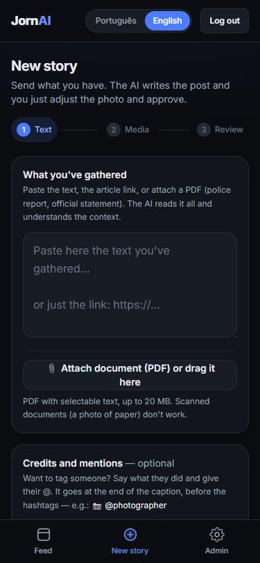
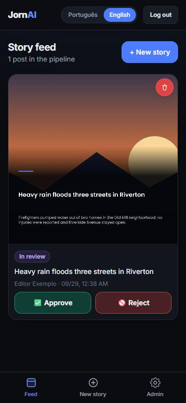
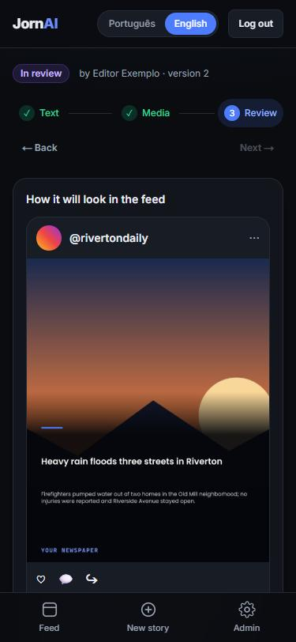

<div align="center">

# JornAI

**From source to Instagram feed in minutes — AI writes the copy, a human always approves.**

An open-source web tool that lets a newsroom publish breaking-news posts to Instagram with almost no friction: paste a police report, a press release or a link, and get a ready-to-review post with a title, subtitle and caption — built on a pipeline designed *not* to invent facts.

[](https://github.com/MatheusBomtempo/JornIA/actions/workflows/ci.yml)
[](LICENSE)


<br />


&nbsp;

&nbsp;


<sub>Mobile-first: capture → feed with one-tap approve/reject → Instagram-style review.</sub>

</div>

---

## Why JornAI

Newsrooms often need to get a short, urgent post out — an accident, a weather alert, a local event — with almost no friction, but still with editorial review and consistent branding. JornAI is **not** a generic social-media scheduler and **not** a raw AI text generator with no guardrails:

- 🧾 **Fact-first.** Sources are cleaned, redacted and checked *before and after* the model, so a confident-sounding article doesn't come with invented details.
- 👀 **Always human-approved.** Nothing reaches Instagram without a person approving it.
- 🎨 **Consistent branding.** Photo + text are composed on a fixed template, in the browser and on the server, with identical results.
- 🌍 **Works in your language.** One environment variable picks the language of the sources and the posts (`en` and `pt` included, more welcome).
- 🆓 **Runs with no keys.** `AI_PROVIDER="mock"` + local storage lets you try the whole flow without any external service.

## How it works

```
Source (photo, text, link, or PDF)
        │
        ▼
AI writes the copy (title, subtitle, caption)
        │
        ▼
Reporter adjusts photo + text in a fixed template
        │
        ▼
Editor reviews → approve / reject / regenerate / edit
        │
        ▼
Publish to Instagram
```

- **AI only writes text** — it never generates or picks images. Photos are always real and chosen by a person.
- Every AI generation (or manual edit) creates a **new version**, so nothing is overwritten and there is a full history.
- Photo **and video** (Reels) posts, with an animated title card for video.
- Peer review: a reporter's post can be approved by a manager/admin, or by two colleagues.
- Multi-tenant: each company has its own feed, templates, style examples and settings.

## Fact-accuracy pipeline

Feeding a police report or an official PDF straight into an LLM is a good way to get a confident-sounding article with wrong facts. JornAI's pipeline is built around not letting that happen:

- Source text is cleaned and compacted **deterministically (no AI)** before it ever reaches a model — official documents/forms get their real fields extracted (who, where, cause, injuries) instead of being blindly truncated.
- **Personal data** (names, national IDs, phone numbers, plates) is redacted before the AI ever sees it.
- The system prompt has explicit, tested rules against inventing details, generic filler, or unsupported claims.
- Generated content is checked against the source by a **deterministic validator** after generation (e.g. the weekday must match the source date, no unsupported claims about investigations, road closures or deaths); a violation triggers one corrective regeneration before failing loudly.
- The weekday is computed by code, never by the model.

## Working language

JornAI works in one language per deployment — the language of the sources and of the generated posts — chosen with the `APP_LANGUAGE` environment variable:

| Value | Effect |
|---|---|
| `en` (default) | Posts are written in English; source cleanup, personal-data redaction and the fact validator use English rules (SSN, US phone numbers, `mm/dd/yyyy` dates). |
| `pt` | Posts are written in Brazilian Portuguese; same pipeline with Brazilian rules (CPF, plates, police-report forms, `dd/mm/yyyy` dates). |

The prompts themselves are written in English; only the examples and rules the model must reproduce live in the language pack (`src/lib/language/<lang>/`). To add a language, add a pack there and register it in `src/lib/language/index.ts` — see [CONTRIBUTING.md](CONTRIBUTING.md). `APP_LANGUAGE` also sets the default interface language (each person can still switch it in the UI); the code, comments and logs are always English.

## Tech stack

- **Next.js** (App Router) + **TypeScript**, **PostgreSQL** via **Prisma**
- **Fabric.js** for the in-browser art editor, **Sharp** for the server-side final render, **ffmpeg** for video
- AI: any OpenAI-compatible or Anthropic text provider (OpenRouter, Groq, Gemini, OpenAI, Claude), with automatic fallback across providers
- Instagram Graph API for publishing; S3/R2-compatible storage (or local disk in dev)

## Roles

| Role | Can do |
|---|---|
| **admin** | Everything — users, API keys, templates, style examples, approve/publish |
| **manager** | Approve/reject/regenerate/edit/publish; manage templates and style examples |
| **staff** (reporter) | Submit sources, edit own drafts before approval |

## Getting started

```bash
git clone https://github.com/MatheusBomtempo/JornIA.git
cd JornIA
npm install
docker compose up -d       # PostgreSQL that matches .env.example (or bring your own)
cp .env.example .env       # fill in DATABASE_URL and, optionally, an AI provider key
npm run db:migrate
npm run db:seed            # sample company + accounts, dev only
npm run dev
```

Open <http://localhost:3000> and sign in with `admin@jornai.local` / `admin12345` (created by the seed, development only).

No AI key yet? Keep `AI_PROVIDER="mock"` in `.env` to run the whole flow with a stub AI response — useful for trying the app without any external service.

### Configuration

Everything is configured through environment variables — see [`.env.example`](.env.example), which documents each one. The important ones:

| Variable | What it does |
|---|---|
| `APP_LANGUAGE` | Working language: `en` or `pt` |
| `DATABASE_URL` / `DIRECT_URL` | PostgreSQL connection |
| `AUTH_SECRET` | Signs the session JWTs |
| `AI_PROVIDER` | `mock`, `chain` (fallback across providers), `openrouter`, `groq`, `gemini`, `openai`, `anthropic` |
| `STORAGE_PROVIDER` | `local` (dev) or `s3` (S3 / Cloudflare R2 / Supabase) |
| `IG_USER_ID` / `IG_ACCESS_TOKEN` | Instagram Graph API publishing |

### Deploying

The project deploys as a regular Next.js app (it is developed against Vercel + Neon + Cloudflare R2). `npm run build` applies the Prisma migrations, so the build needs the database configured.

## Documentation

- [`SPEC.md`](SPEC.md) — full technical spec: database schema, API endpoints, state machine, Instagram publishing.
- [`CONTRIBUTING.md`](CONTRIBUTING.md) — how to contribute and how to add a language.
- [`SECURITY.md`](SECURITY.md) — how to report a vulnerability.

## Roadmap ideas

- More language packs (Spanish, French, …)
- More official-document profiles (the way police-report forms are cleaned today)
- Stories and other social networks (deliberately out of scope for now)

Not planned, on purpose: scheduling, AI image generation, and publishing without human approval.

## Contributing

Issues and pull requests are welcome — read [CONTRIBUTING.md](CONTRIBUTING.md) first. If JornAI is useful to you, a ⭐ helps other newsrooms find it.

## License

MIT — see [`LICENSE`](LICENSE).
